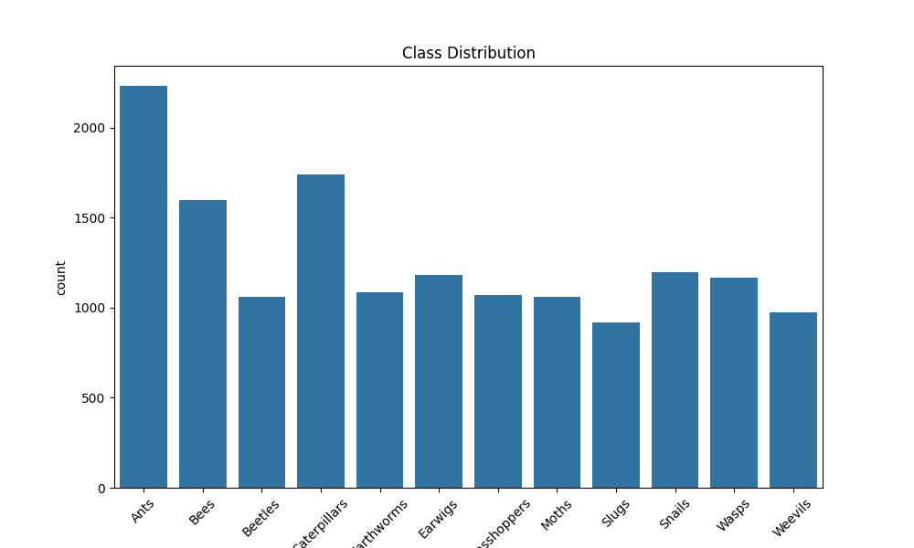
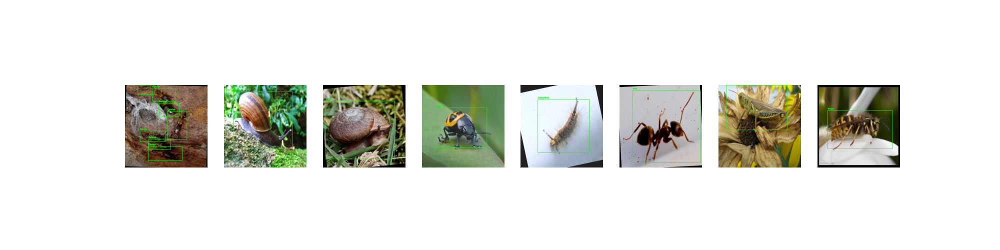
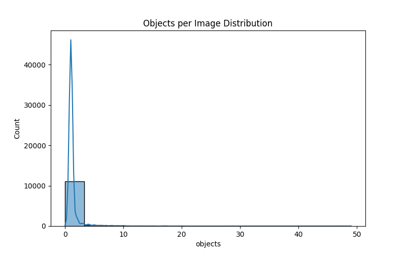
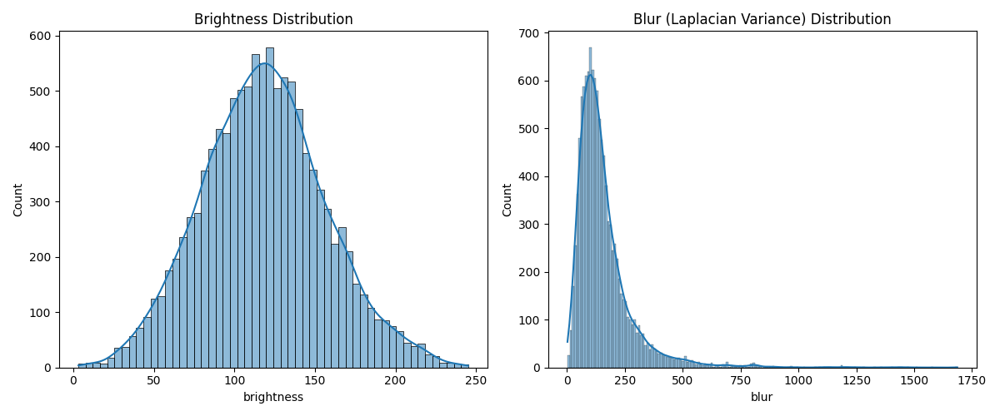
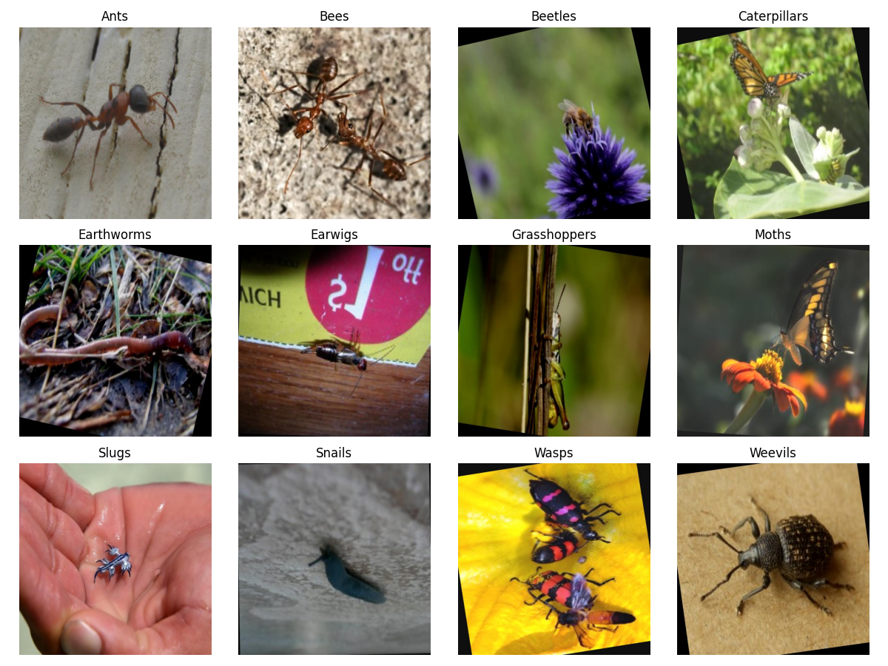

# AgroPest-12 EDA Report

## 1. Data Quantity
{'train': {'images': 11502, 'labels': 11502, 'match_rate': True}, 'valid': {'images': 1095, 'labels': 1095, 'match_rate': True}, 'test': {'images': 546, 'labels': 546, 'match_rate': True}}

## 2. Class Distribution
Max/Min Ratio: 2.43

## 3. Image Sizes

## 4. BBox Quality
Invalid: 0/17312 (0.00%)
Empty: 3

## 5. Objects per Image
Avg: 1.33, Max: 49

## 6. Image Quality

Extreme Samples: extreme_0.jpg, extreme_1.jpg, ... (check folder)

## 7. Class Differences

## 8. Split Consistency

## 9. Augmentation Suggestions
| 问题       | 策略                |
|:-----------|:--------------------|
| 夜间样本少 | 光照增强（CLAHE等） |
